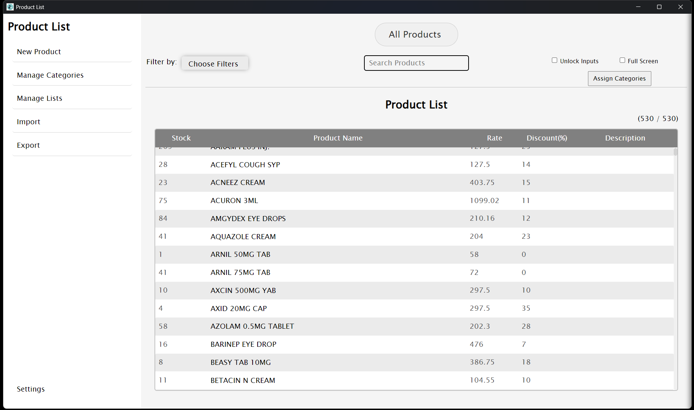
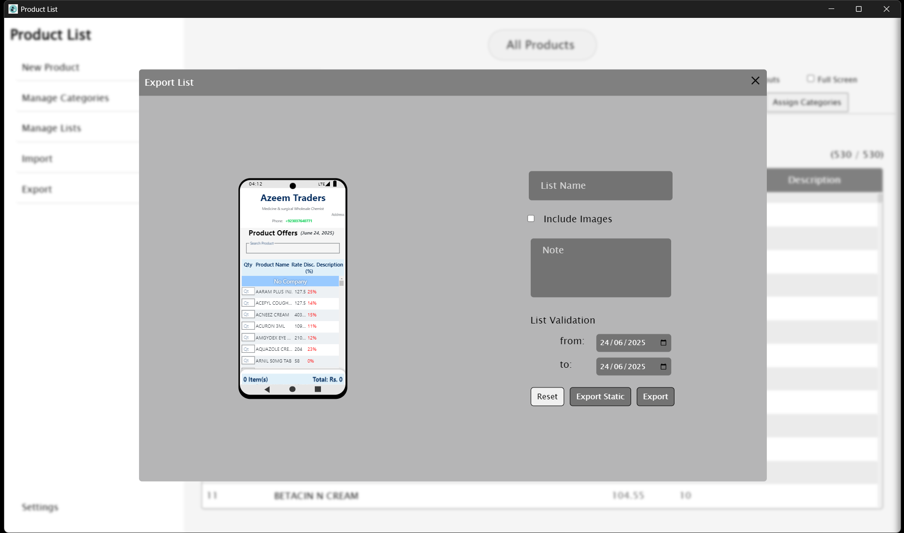

# 🧾 Product List Generator – Electron App

An Electron-based desktop app designed to automate daily product listings for small businesses (like pharmacies) by extracting and formatting data from ERP systems.

---

## 🚀 Features

- 📦 Extracts stock, name, quantity, rate, and descriptions from an ERP (Book Keeper)
- ✍️ Allows editing and customizing product list before export
- 📄 Generates a downloadable HTML product sheet
- 📷 One-click image export for sharing
- 💬 WhatsApp integration for one-tap customer order submission

---

## 🛠 Tech Stack

- **Frontend:** HTML, CSS, JavaScript
- **Framework:** Electron.js
- **ERP Source:** Book Keeper (local DB parsing)
- **Extras:** WhatsApp URI automation, simple offline desktop architecture

---

## 🖼 Screenshots

### 🧾 Dashboard View


### 📄 Product List Output


### 💬 WhatsApp Order Example


## 🧑‍💼 Use Case

> Built for a real-world pharmacy to streamline daily offer sheet generation and simplify order-taking via WhatsApp or downloadable image.

---

## 📦 Setup Instructions

```bash
npm install
npm start
